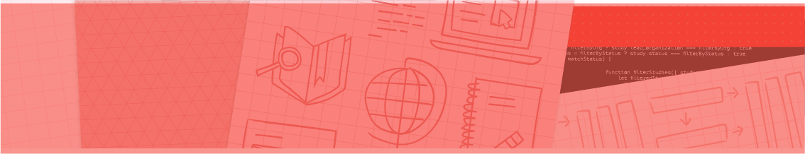
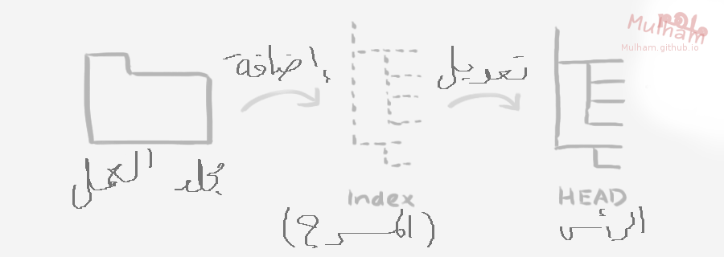

# dscly-git-infosession

 

<b><h2>
GDSC - Git & Github Repo
</h2></b>
<b>
this repo includes the needed things for the GDSC Git & Github info session
</b>

try to fork this repo to your account and work on it 😉.

Created By: Taha Alabyad

 

<b>Presentation File</b>: <a href="Git & Github.pdf">PDF File</a> or <a href="https://drive.google.com/file/d/1Gk5gVmJhygHUIX4nnBlcET0k3zDjnUCW/view?usp=sharing">Google Drive PDF File</a> 

<b>Git Download Link</b>: https://git-scm.com/downloads 

<b>Git Installation Guide</b>: https://youtube.com/playlist?list=PLs97GbUOC82nudd7axMvObNxEm59XwIhs 

<b>Git Command Ref</b>: https://git-scm.com/book/en/v2 

<b>Centralized vs Distributed Version Control</b> : https://www.geeksforgeeks.org/centralized-vs-distributed-version-control-which-one-should-we-choose/  

<b>Github Education</b>: https://education.github.com/pack 

<b>Github Desktop</b>: https://desktop.github.com/ 

<b>the next picture explains how repo works:</b>

 

<b>Configure Tooling</b> 
git config --global user.name "[name]" 
<i>Sets the name you want attached to your commit transactions</i> 
git config --global user.email "[email address]" 
<i>Sets the email you want attached to your commit transactions</i> 

<b>Create Repositories</b> 
git init [project-name] 
<i>Creates a new local repository with the specified name</i> 
git clone [url] 
<i>Downloads a project and its entire version history</i> 

<b>Group Changes</b> 
git branch 
<i>Lists all local branches in the current repository</i> 
git branch [branch-name] 
<i>Creates a new branch</i> 
git checkout [branch-name] 
<i>Switches to the specified branch and updates the working directory</i> 
git merge [branch] 
<i>Combines the specified branch's history into the current branch</i> 
git branch -d [branch-name] 
<i>Deletes the specified branch</i> 
git remote add [remote-name] [url] 
<i>Add a new remote git repository as a shortname</i> 
git remote -v 
<i>Lists all remote git repositories</i> 

<b>Make Changes</b> 
git status 
<i>Lists all new or modified files to be committed</i> 
git diff 
<i>Shows file differences not yet staged</i> 
git add [file] 
<i>Snapshots the file in preparation for versioning</i> 
git diff --staged 
<i>Shows file differences between staging and the last file version</i> 
git reset [file] 
<i>Unstages the file, but preserves its contents</i> 
git commit -m "[descriptive message]" 
<i>Records the file snapshots permanently in version history</i> 

<b>Save Fragments</b> 
git stash 
<i>Temporarily stores all modified tracking files</i> 

<b>Review History</b> 
git log 
<i>Lists version history for the current branch</i> 
git log --follow [file] 
<i>Lists version history for a file, including renames</i> 
git diff [first-branch]...[second-branch] 
<i>Shows content differences between two branches</i> 
git show [commit] 
<i>Outputs metadata and content changes of the specified commit</i> 